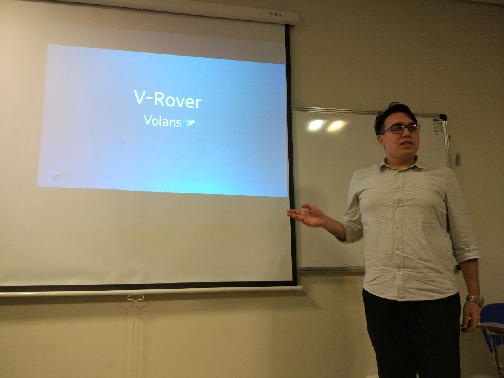

This project was a joint project with Mr. Amir Mohammad Vahedi, which aimed to design a robot in SolidWorks and then build it; it can control autonomously and show its status by a GUI design via Python.

Project Presentation : 

You can also watch project presentation slides Here.