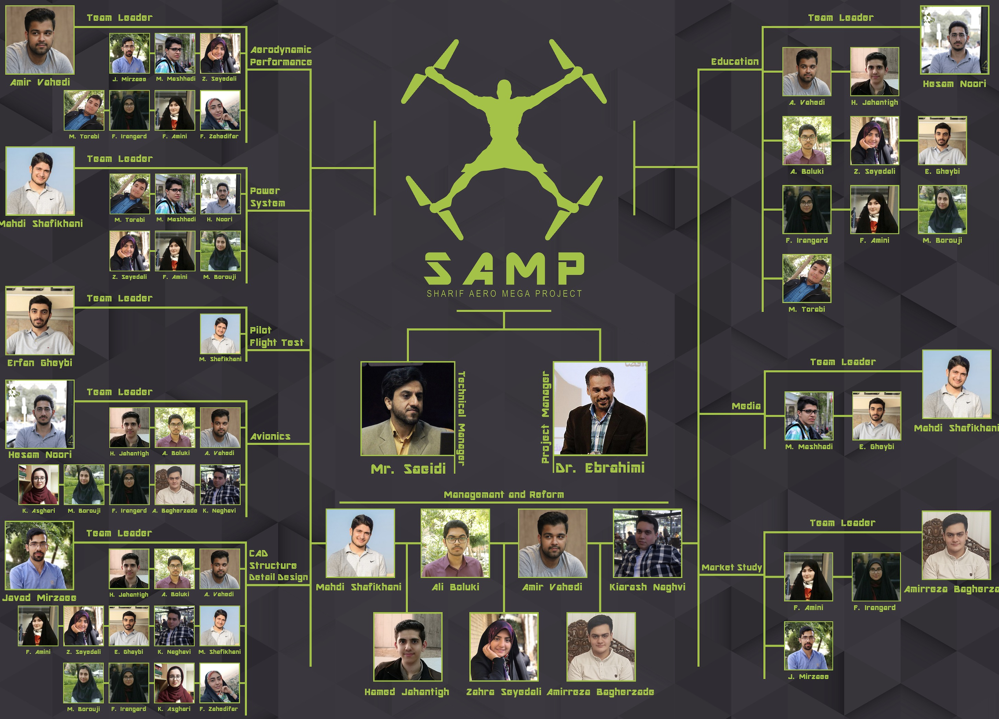
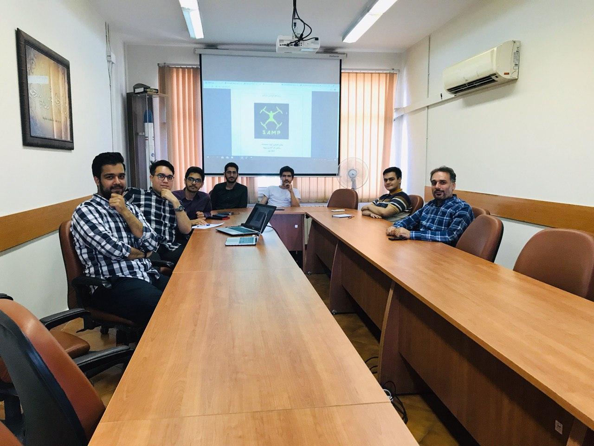

I was a Project Management team member, and I also had minor responsibilities at the structure division. You can see a summary presentation of this project [Here](https://drive.google.com/file/d/1A5buO3ZXzjyVoncwM5hMZ7usFCqPfOL9/view?usp=sharing).
\
Furthermore, there is a [control project plan](https://drive.google.com/file/d/1CAcwIpdpDinnr4CCJtLlCg28N4mYlq5R/view?usp=sharing) that you can observe.\
\
Team_poster :

\
\
\
Team members meeting: 

